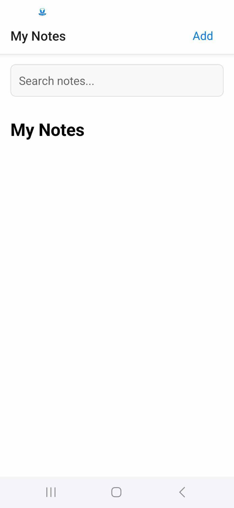
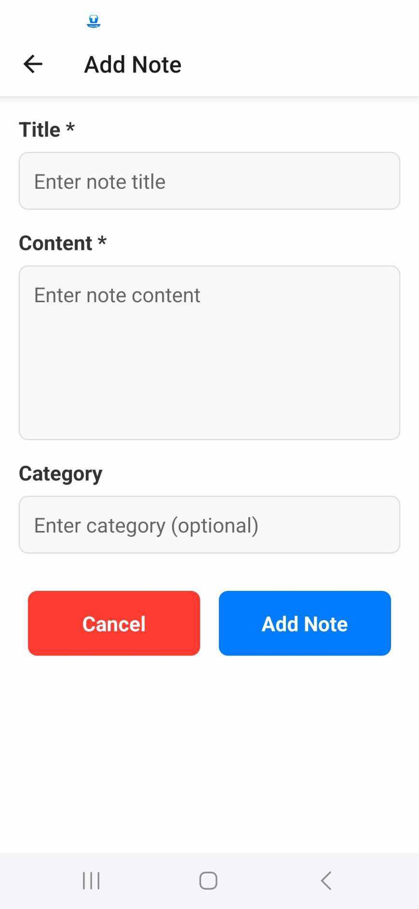
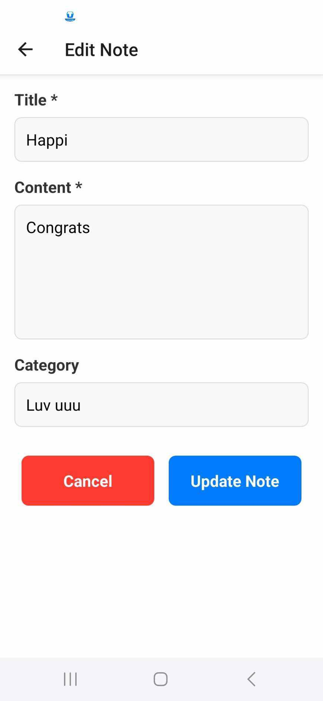

Take-home | Take-home Assignment Template     
Name: Aphicha Dancharoenrak    
Student ID: 6631503047    
App Name: Helpme    
Framework Used: React Native    
GitHub Repository: https://github.com/aphichaidancharoenrak/Helpme-app.git   
APK/IPA: https://drive.google.com/file/d/1wQl5SBurCQQFd6TDWmlE_jznEym6HAt4/view    

1.1 Personas
Persona 1:
- Name: Q
- Age: 21
- Occupation: University freshman
- Pain Point: Often forgets tasks or ideas during busy days.
- Goal: Needs a quick and simple tool to jot down reminders anytime, anywhere.
Persona 2:
- Name: Long
- Age: 19
- Occupation: Undergraduate student
- Pain Point: Wants to capture daily highlights without using complicated diary apps.
- Goal: Needs a minimalist app to record short stories or notes effortlessly.

1.2 App Goals
- Primary Goal: Help users record important notes quickly.
- Secondary Goal: Make it easy to retrieve and review past notes.
Design philosophy: Minimal UI, maximum speed of access. Focused only on essential functionalities.

1.3Mockup

1.3User Flow    
Open app > Homescreen > Add note > Write you note > Save > Show you Note in Homescreen

2.App Implementation    
2.1Tools used:    
-React Native(expo)   
-React-Navigation   
-Expo-cli    
2.2Features Implemented    
-Find the topic that you have noted.    
-add note  / edit note / delete note    

3. Deployment

3.1Build Type    
Debug   
3.2 Platform Test   
Android    
3.3Install Guide   

Link: https://drive.google.com/file/d/1wQl5SBurCQQFd6TDWmlE_jznEym6HAt4/view for dowload

4.Reflection    
-I want to add a notification future.   
-I want to try developing this app into the app store.    
-Having trouble trying out Build on iOS platform   
-My icon its not show in app   

5.AI Assisted Development    
Prompt: The topic I asked it to design was: I want a note app to record what I did that day.   
ANS: Let AI design the necessary features in the app.    
Prompt: Let AI design the necessary futures in the app.    
ANS: AI suggested 3 main features for the app:   
1.	Create notes    
2.	View past notes   
3.	Edit and delete notes   

Prompt: Let AI help you fix the bugs you receive and check where the problems are.   
ANS: AI assisted in fixing bugs by:    
•	Analyzing error messages    
•	Identifying the source of problems    
•	Suggesting solutions to quickly fix issues    

Prompt: How to build a React Native (Expo) app as an APK and test it on Android?   
ANS:  AI provided the command to build the APK:   
•	npx eas build -p android     
  If errors occur during the build, AI suggested an alternative command:   
•	./gradlew assembleDebug (for local builds after ejecting from Expo)   
